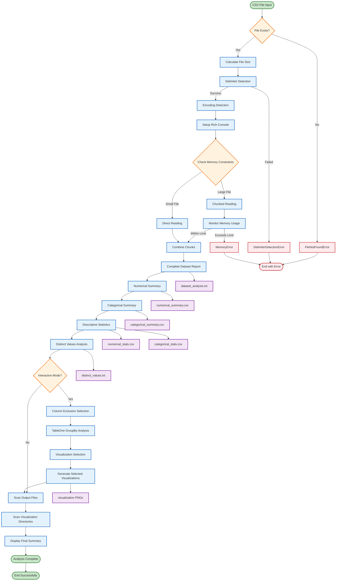
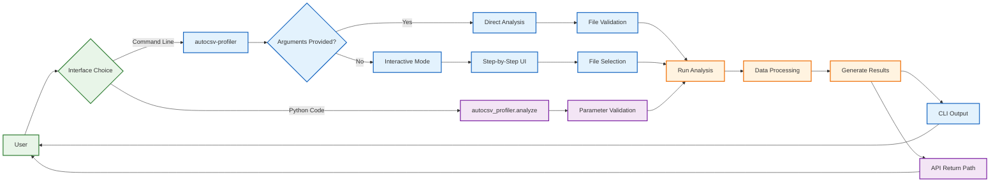

# Architecture Diagrams

## Table of Contents
- [Architecture Diagrams](#architecture-diagrams)
  - [Table of Contents](#table-of-contents)
  - [Data Processing Flow](#data-processing-flow)
  - [CLI and API Architecture](#cli-and-api-architecture)
  - [Configuration Flow](#configuration-flow)
  - [Core Analysis Engine](#core-analysis-engine)
  - [See Also](#see-also)

## Data Processing Flow

This flowchart illustrates the complete CSV analysis pipeline from input to output.

The pipeline validates CSV files, processes data in chunks with memory management, performs statistical analysis, handles interactive workflows, and generates output files.

## CLI and API Architecture

This diagram shows how users interact with the system through different interfaces.

Users can access the system via command line (direct or interactive modes) or Python API, both converging to the same analysis engine.

## Configuration Flow

This flowchart demonstrates the configuration loading and management process.

```mermaid
flowchart TD
    START([Application Start]) --> SINGLETON{Settings Instance<br>Exists?}

    SINGLETON -->|No| CREATE[Create Settings Instance]
    SINGLETON -->|Yes| GET[Get Existing Instance]

    CREATE --> LOAD_DEFAULTS[Load Default Configuration]
    GET --> APPLY_ENV[Apply Environment Overrides]

    LOAD_DEFAULTS --> DEFAULT_VALUES[Set Default Values<br>memory_limit_gb = 1<br>chunk_size = 10000<br>logging level = INFO<br>project name and version<br>delimiter confidence = 0.7<br>high cardinality = 20]

    DEFAULT_VALUES --> APPLY_ENV

    APPLY_ENV --> SCAN_ENV[Scan Environment Variables<br>AUTOCSV_* prefix]

    SCAN_ENV --> FOUND_ENV{Environment<br>Variables Found?}

    FOUND_ENV -->|Yes| PARSE_ENV[Parse Environment Values]
    FOUND_ENV -->|No| VALIDATE_CONFIG

    PARSE_ENV --> CONVERT_TYPES[Convert Value Types<br>string to int/float/bool]
    CONVERT_TYPES --> UPDATE_CONFIG[Update Configuration Dictionary]
    UPDATE_CONFIG --> VALIDATE_CONFIG[Validate Configuration]

    VALIDATE_CONFIG --> CHECK_MEMORY{Memory Limit<br>Valid?}
    CHECK_MEMORY -->|No| CONFIG_ERROR[ConfigValidationError]
    CHECK_MEMORY -->|Yes| CHECK_CHUNK{Chunk Size<br>Valid?}

    CHECK_CHUNK -->|No| CONFIG_ERROR
    CHECK_CHUNK -->|Yes| CHECK_DELIMITER{Delimiter Confidence<br>Valid 0-1?}

    CHECK_DELIMITER -->|No| CONFIG_ERROR
    CHECK_DELIMITER -->|Yes| CHECK_LOGGING{Logging Level<br>Valid?}

    CHECK_LOGGING -->|No| CONFIG_ERROR
    CHECK_LOGGING -->|Yes| CONFIG_READY[Configuration Ready]

    CONFIG_READY --> RUNTIME[Runtime Access<br>settings.get performance memory_limit_gb]

    CONFIG_ERROR --> END([End with Error])
    RUNTIME --> END([Configuration Available])

    %% Environment Variable Examples
    SCAN_ENV -.-> ENV_EXAMPLES[Environment Examples<br>AUTOCSV_PERFORMANCE_MEMORY_LIMIT_GB<br>AUTOCSV_PERFORMANCE_CHUNK_SIZE<br>AUTOCSV_LOGGING_LEVEL]

    %% Styling
    classDef startEnd fill:#c8e6c9,stroke:#2e7d32,stroke-width:2px
    classDef process fill:#e3f2fd,stroke:#1565c0,stroke-width:2px
    classDef decision fill:#fff3e0,stroke:#ef6c00,stroke-width:2px
    classDef config fill:#f3e5f5,stroke:#7b1fa2,stroke-width:2px
    classDef error fill:#ffebee,stroke:#c62828,stroke-width:2px
    classDef example fill:#f1f8e9,stroke:#689f38,stroke-width:1px,stroke-dasharray: 5 5

    class START,END startEnd
    class CREATE,GET,LOAD_DEFAULTS,APPLY_ENV,SCAN_ENV,PARSE_ENV,CONVERT_TYPES,UPDATE_CONFIG,VALIDATE_CONFIG,CONFIG_READY,RUNTIME process
    class SINGLETON,FOUND_ENV,CHECK_MEMORY,CHECK_CHUNK,CHECK_DELIMITER,CHECK_LOGGING decision
    class DEFAULT_VALUES config
    class CONFIG_ERROR error
    class ENV_EXAMPLES example
```

The system loads default settings, applies environment variable overrides with AUTOCSV_ prefix, validates configuration parameters, and provides runtime access.

## Core Analysis Engine

This flowchart shows the actual analyzer.main function processing flow of the analysis system.

```mermaid
flowchart TD
    START([Analysis Request]) --> MAIN_FUNCTION[analyzer.main function]

    MAIN_FUNCTION --> ENV_SETUP[Set TF_LOG_LEVEL Environment]
    ENV_SETUP --> CALC_SIZE[Calculate File Size]

    CALC_SIZE --> DELIMITER_DETECT[Delimiter Detection Logic]
    DELIMITER_DETECT -->|Success| CHUNK_READ[Chunked CSV Reading]
    DELIMITER_DETECT -->|Failed| DELIMITER_ERROR[Delimiter Error]

    CHUNK_READ --> MEMORY_MONITOR[Monitor Memory with psutil]
    MEMORY_MONITOR -->|Within Limit| COMBINE_DATA[Combine Chunks]
    MEMORY_MONITOR -->|Exceeds Limit| MEMORY_ERROR[Memory Error]

    COMBINE_DATA --> ENCODING_DETECT[Encoding Detection with charset_normalizer]
    ENCODING_DETECT --> PROGRESS_SETUP[Setup Rich Progress UI]

    PROGRESS_SETUP --> SUPPRESS_LOGS[Suppress Logging During Progress]
    SUPPRESS_LOGS --> DATASET_REPORT[Generate Complete Dataset Report]

    DATASET_REPORT --> PROGRESS_UPDATE1[Update Progress]
    PROGRESS_UPDATE1 --> SUMMARY_STATS[Statistical Summaries]

    SUMMARY_STATS --> PROGRESS_UPDATE2[Update Progress]
    PROGRESS_UPDATE2 --> DESCRIPTIVE_STATS[ResearchPy Descriptive Stats]

    DESCRIPTIVE_STATS --> PROGRESS_UPDATE3[Update Progress]
    PROGRESS_UPDATE3 --> DISTINCT_VALUES[Distinct Values Analysis]

    DISTINCT_VALUES --> INTERACTIVE_CHECK{Interactive Mode?}
    INTERACTIVE_CHECK -->|Yes| COLUMN_EXCLUDE[Column Exclusion UI]
    INTERACTIVE_CHECK -->|No| FILE_SCAN[Scan Output Files]

    COLUMN_EXCLUDE --> TABLEONE_GROUP[TableOne GroupBy Analysis]
    TABLEONE_GROUP --> VIZ_SELECTION[Visualization Selection UI]
    VIZ_SELECTION --> FILE_SCAN

    FILE_SCAN --> VIZ_SCAN[Scan Visualization Directories]
    VIZ_SCAN --> FINAL_DISPLAY[Display Final Results]

    FINAL_DISPLAY --> COMPLETE([Analysis Complete])

    %% Error Paths
    DELIMITER_ERROR --> ERROR_EXIT[System Exit with Error]
    MEMORY_ERROR --> ERROR_EXIT

    %% Success Path
    COMPLETE --> SUCCESS_EXIT([Success])

    %% Styling
    classDef startEnd fill:#c8e6c9,stroke:#2e7d32,stroke-width:2px
    classDef process fill:#e3f2fd,stroke:#1565c0,stroke-width:2px
    classDef decision fill:#fff3e0,stroke:#ef6c00,stroke-width:2px
    classDef error fill:#ffebee,stroke:#c62828,stroke-width:2px
    classDef interactive fill:#e1f5fe,stroke:#0288d1,stroke-width:2px

    class START,COMPLETE,SUCCESS_EXIT startEnd
    class MAIN_FUNCTION,ENV_SETUP,CALC_SIZE,DELIMITER_DETECT,CHUNK_READ,MEMORY_MONITOR,COMBINE_DATA,ENCODING_DETECT,PROGRESS_SETUP,SUPPRESS_LOGS,DATASET_REPORT,SUMMARY_STATS,DESCRIPTIVE_STATS,DISTINCT_VALUES,FILE_SCAN,VIZ_SCAN,FINAL_DISPLAY,PROGRESS_UPDATE1,PROGRESS_UPDATE2,PROGRESS_UPDATE3 process
    class INTERACTIVE_CHECK decision
    class COLUMN_EXCLUDE,TABLEONE_GROUP,VIZ_SELECTION interactive
    class DELIMITER_ERROR,MEMORY_ERROR,ERROR_EXIT error
```

The core engine processes CSV files through environment setup, file validation, data loading with memory monitoring, statistical analysis, optional interactive phases, and results generation.

## See Also

- [Documentation Index](index.md) - Complete documentation overview
- [User Guide](user-guide.md) - Installation and usage documentation
- [API Reference](api-reference.md) - Python API documentation
- [Configuration](configuration.md) - Settings and environment variables
- [Developer Guide](developer-guide.md) - Development documentation
- [Troubleshooting](troubleshooting.md) - Problem-solving guide

---

Version: 2.0.0 | Status: Beta | Python: 3.8-3.13

Copyright 2025 dhaneshbb | License: MIT | Homepage: https://github.com/dhaneshbb/autocsv-profiler
