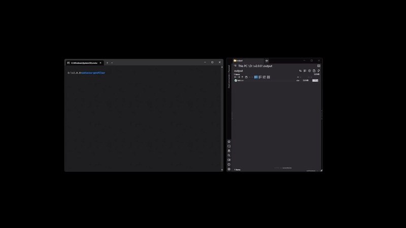
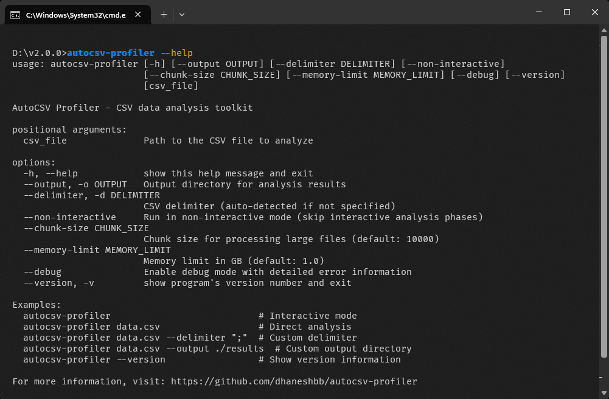
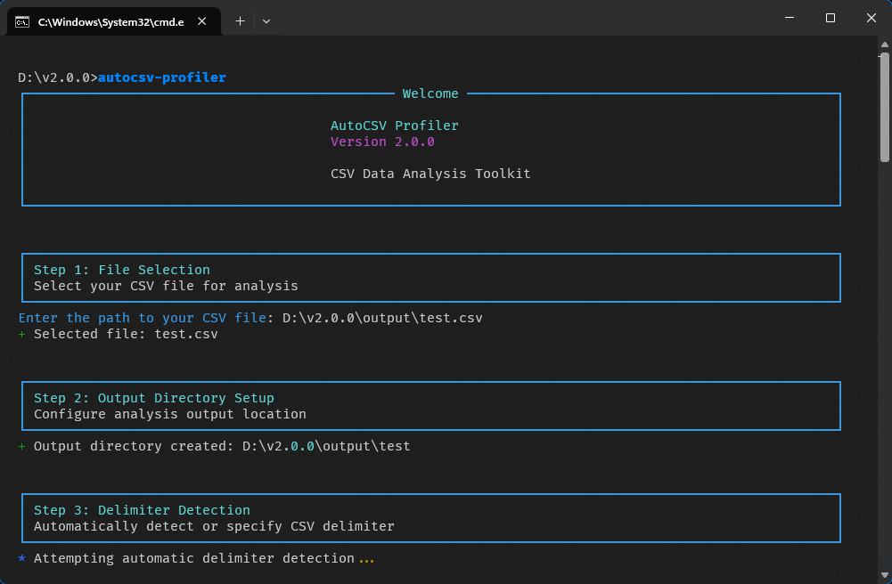
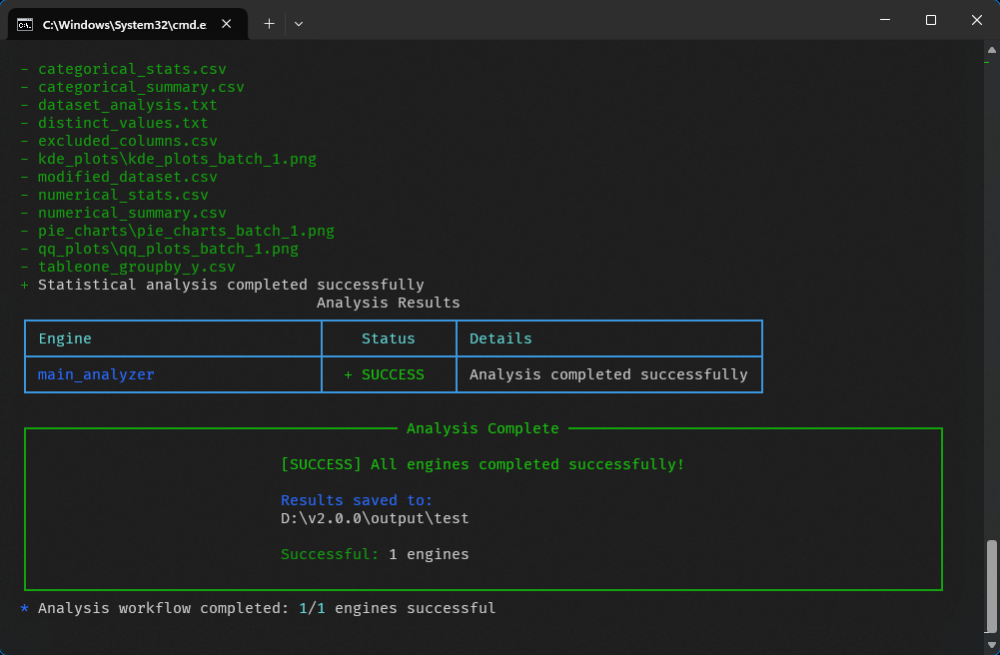

# User Guide

## Table of Contents
- [Quick Start](#quick-start)
- [Installation](#installation)
- [Command-Line Usage](#command-line-usage)
- [Python API Usage](#python-api-usage)
- [Environment Configuration](#environment-configuration)
- [Real-World Examples](#real-world-examples)
- [Output Files](#output-files)
- [Troubleshooting](#troubleshooting)
- [See Also](#see-also)

## Quick Start



Basic CSV analysis:
```bash
autocsv-profiler sales_data.csv
```

Interactive mode (recommended for first-time users):
```bash
autocsv-profiler
```

## Installation

### Requirements

- Python 3.8 or higher
- Operating System: Windows, macOS, Linux

### Install from PyPI

```bash
pip install autocsv-profiler
```

### Install from Source

1. Clone the repository:
```bash
git clone https://github.com/dhaneshbb/autocsv-profiler.git
cd autocsv-profiler
```

2. Install in development mode:
```bash
pip install -e .
```

### Verify Installation

Check installation:
```bash
autocsv-profiler --version
```

Test basic functionality:
```bash
autocsv-profiler --help
```

### Dependencies

**Core Dependencies:**
- pandas==2.3.1
- numpy==2.2.6
- scipy>=1.10.0
- matplotlib>=3.5.0
- seaborn>=0.11.0
- rich==14.1.0
- psutil==7.0.0

**Optional Dependencies:**
- researchpy>=0.3.0 (statistical analysis)
- charset-normalizer>=3.0.0 (encoding detection)
- pyyaml==6.0.2 (configuration)
- tabulate==0.9.0 (table formatting)
- tableone==0.9.5 (statistical summaries)

## Command-Line Usage



### Interactive Mode

Run without arguments for step-by-step guidance:
```bash
autocsv-profiler
```
|  Analysis Start | Analysis Complete |
|---------------------------|-------------------|
|  |  |

Interactive mode provides:
1. File selection
2. Output directory setup
3. Delimiter detection
4. Analysis execution

### Direct Analysis

Analyze a CSV file directly:
```bash
autocsv-profiler data.csv
```

### Command Options

#### Required Arguments
- `csv_file` - Path to CSV file to analyze

#### Optional Arguments

**Output Directory:**
```bash
autocsv-profiler data.csv --output results/
autocsv-profiler data.csv -o results/
```

**CSV Delimiter:**
```bash
autocsv-profiler data.csv --delimiter ";"
autocsv-profiler data.csv -d "|"
```

**Non-Interactive Mode:**
```bash
autocsv-profiler data.csv --non-interactive
```

**Memory and Performance:**
```bash
# Set memory limit (GB)
autocsv-profiler data.csv --memory-limit 2.0

# Set chunk size for large files
autocsv-profiler data.csv --chunk-size 5000
```

**Debug Mode:**
```bash
autocsv-profiler data.csv --debug
```

**Version Information:**
```bash
autocsv-profiler --version
autocsv-profiler -v
```

### CLI Examples

**Standard Analysis:**
```bash
autocsv-profiler sales_data.csv
```

**Custom Output Location:**
```bash
autocsv-profiler sales_data.csv --output /path/to/results/
```

**Semicolon-Delimited File:**
```bash
autocsv-profiler european_data.csv --delimiter ";"
```

**Large File Processing:**
```bash
autocsv-profiler large_dataset.csv --memory-limit 4.0 --chunk-size 20000
```

**Automated Processing:**
```bash
autocsv-profiler data.csv --non-interactive --output batch_results/
```

**Debug Analysis:**
```bash
autocsv-profiler problematic.csv --debug
```

### Exit Codes

- `0` - Success
- `1` - General error
- `2` - File not found
- `3` - Invalid arguments

## Python API Usage

For a visual overview of how the Python API integrates with the analysis workflow, see the [CLI and API Architecture diagram](diagrams.md#cli-and-api-architecture).

### Basic Analysis

```python
import autocsv_profiler

# Simple analysis
result_dir = autocsv_profiler.analyze('sales_data.csv')
print(f"Analysis saved to: {result_dir}")
```

### Custom Configuration

```python
import autocsv_profiler

result_dir = autocsv_profiler.analyze(
    csv_file_path='customer_data.csv',
    output_dir='analysis_output/',
    delimiter=',',
    chunk_size=15000,
    memory_limit_gb=2
)
```

### Interactive Analysis

```python
import autocsv_profiler

# Enable interactive mode (step-by-step guidance)
result_dir = autocsv_profiler.analyze(
    csv_file_path='survey_data.csv',
    interactive=True
)
```

### Error Handling

```python
import autocsv_profiler
from autocsv_profiler import (
    FileProcessingError,
    DelimiterDetectionError,
    AutoCSVProfilerError
)

def safe_analysis(csv_path):
    try:
        result = autocsv_profiler.analyze(csv_path)
        print(f"Analysis completed: {result}")
        return result
    except FileProcessingError as e:
        print(f"File processing failed: {e}")
    except DelimiterDetectionError as e:
        print(f"Could not detect delimiter: {e}")
    except AutoCSVProfilerError as e:
        print(f"Analysis error: {e}")
    except Exception as e:
        print(f"Unexpected error: {e}")
    return None

# Usage
safe_analysis('data.csv')
```

### Batch Processing

```python
import autocsv_profiler
from pathlib import Path

def analyze_directory(input_dir, output_base_dir):
    """Analyze all CSV files in a directory."""
    input_path = Path(input_dir)
    output_path = Path(output_base_dir)

    csv_files = list(input_path.glob("*.csv"))
    results = []

    for csv_file in csv_files:
        try:
            output_dir = output_path / csv_file.stem
            result = autocsv_profiler.analyze(
                csv_file_path=str(csv_file),
                output_dir=str(output_dir),
                memory_limit_gb=2,
                chunk_size=20000
            )
            results.append({
                'file': csv_file.name,
                'status': 'success',
                'output': result
            })
            print(f"Analyzed: {csv_file.name}")
        except Exception as e:
            results.append({
                'file': csv_file.name,
                'status': 'error',
                'error': str(e)
            })
            print(f"Failed: {csv_file.name} - {e}")

    return results

# Usage
results = analyze_directory('csv_files/', 'analysis_results/')
```

## Environment Configuration

See the [Configuration Flow diagram](diagrams.md#configuration-flow) for details on how environment variables are processed and applied.

### High-Performance Setup

```bash
# Set environment variables
export AUTOCSV_PERFORMANCE_MEMORY_LIMIT_GB=8
export AUTOCSV_PERFORMANCE_CHUNK_SIZE=100000
export AUTOCSV_LOGGING_LEVEL=WARNING

# Run analysis with high-performance settings
autocsv-profiler large_dataset.csv
```

### Debug Configuration

```bash
# Enable debug logging
export AUTOCSV_LOGGING_LEVEL=DEBUG
export AUTOCSV_LOGGING_CONSOLE_LEVEL=DEBUG

# Run with debug output
autocsv-profiler problematic_data.csv --debug
```

### Production Batch Processing

```bash
# Silent operation with file logging only
export AUTOCSV_LOGGING_CONSOLE_ENABLED=false
export AUTOCSV_LOGGING_FILE_ENABLED=true
export AUTOCSV_LOGGING_FILE_FILENAME=batch_analysis.log
export AUTOCSV_PERFORMANCE_MEMORY_LIMIT_GB=4

# Process multiple files
for file in *.csv; do
    autocsv-profiler "$file" --non-interactive --output "results/$(basename "$file" .csv)/"
done
```

### Environment Variables

Set default behavior:
```bash
export AUTOCSV_MEMORY_LIMIT_GB=2
export AUTOCSV_CHUNK_SIZE=15000
autocsv-profiler data.csv
```

## Real-World Examples

### E-commerce Sales Analysis

```bash
# Analyze sales data with European formatting
autocsv-profiler sales_q4_2024.csv \
    --delimiter ";" \
    --output sales_reports/q4_analysis/ \
    --memory-limit 2.0
```

### Survey Data Processing

```python
import autocsv_profiler

# Process survey responses with interactive exploration
autocsv_profiler.analyze(
    csv_file_path='survey_responses_2024.csv',
    output_dir='survey_analysis/',
    interactive=True,
    chunk_size=5000  # Smaller chunks for detailed analysis
)
```

### Log File Analysis

```bash
# Process large log files efficiently
export AUTOCSV_PERFORMANCE_MEMORY_LIMIT_GB=6
export AUTOCSV_PERFORMANCE_CHUNK_SIZE=50000

autocsv-profiler server_logs.csv \
    --delimiter "," \
    --non-interactive \
    --output log_analysis/
```

### Financial Data Analysis

```python
import autocsv_profiler

# Analyze financial data with custom settings
result = autocsv_profiler.analyze(
    csv_file_path='financial_transactions.csv',
    output_dir='financial_reports/',
    delimiter=',',
    memory_limit_gb=3,
    chunk_size=25000
)

print(f"Financial analysis completed: {result}")
```

### Custom Delimiter Examples

```bash
# European CSV format (semicolon-delimited)
autocsv-profiler european_sales.csv --delimiter ";"

# Tab-delimited files
autocsv-profiler data.tsv --delimiter $'\t'

# Pipe-delimited files
autocsv-profiler data.txt --delimiter "|"
```

### Large File Processing Examples

```bash
# 4GB memory limit, 50K row chunks
autocsv-profiler large_dataset.csv --memory-limit 4.0 --chunk-size 50000
```

## Output Files


The [Data Processing Flow diagram](diagrams.md#data-processing-flow) shows how these output files are generated during the analysis process.

Analysis generates multiple output files in the specified directory:

### Data Summary Files
- `dataset_analysis.txt` - Dataset overview and basic statistics
- `numerical_stats.csv` - Numerical column statistics (mean, std, min, max)
- `categorical_stats.csv` - Categorical column statistics
- `numerical_summary.csv` - Summary statistics for numeric columns
- `categorical_summary.csv` - Summary for categorical columns

### Data Quality Files
- `distinct_values.txt` - Unique value counts per column
- `excluded_columns.csv` - Columns excluded from analysis
- `modified_dataset.csv` - Processed dataset (if modifications made)

### Visualization Files
- `kde_plots/kde_plots_batch_1.png` - Kernel density plots
- `qq_plots/qq_plots_batch_1.png` - Q-Q plots for normality testing
- `pie_charts/pie_charts_batch_1.png` - Categorical distribution charts
- `tableone_groupby_v.csv` - Statistical summary tables

### Process Files
- `autocsv_profiler.log` - Processing log file

## Troubleshooting

### Installation Issues

**Import Errors:**
```bash
python -c "import autocsv_profiler; print('OK')"
```

**Permission Issues (Linux/macOS):**
```bash
pip install --user autocsv-profiler
```

**Version Conflicts:**
```bash
pip check
pip install --upgrade autocsv-profiler
```

### Performance Issues

**Memory Management:**
- Use `--memory-limit` for large files (>1GB)
- Increase `--chunk-size` for better performance with large datasets
- Monitor memory usage in debug mode

**Delimiter Detection:**
- Specify delimiter explicitly for non-standard formats
- Use debug mode to troubleshoot detection issues

### Best Practices

**Automation:**
- Use `--non-interactive` for batch processing
- Set environment variables for consistent behavior
- Implement error handling in scripts

**Performance Optimization:**
- Use environment variables for repeated settings
- Process files in parallel for batch operations
- Adjust chunk size based on available memory

## See Also

- [Documentation Index](index.md) - Complete documentation overview
- [API Reference](api-reference.md) - Python API documentation
- [Configuration](configuration.md) - Settings and environment variables
- [Developer Guide](developer-guide.md) - Development documentation
- [Troubleshooting](troubleshooting.md) - Problem-solving guide
- [Architecture Diagrams](diagrams.md) - Visual system architecture


---

Version: 2.0.0 | Status: Beta | Python: 3.8-3.13

Copyright 2025 dhaneshbb | License: MIT | Homepage: https://github.com/dhaneshbb/autocsv-profiler
